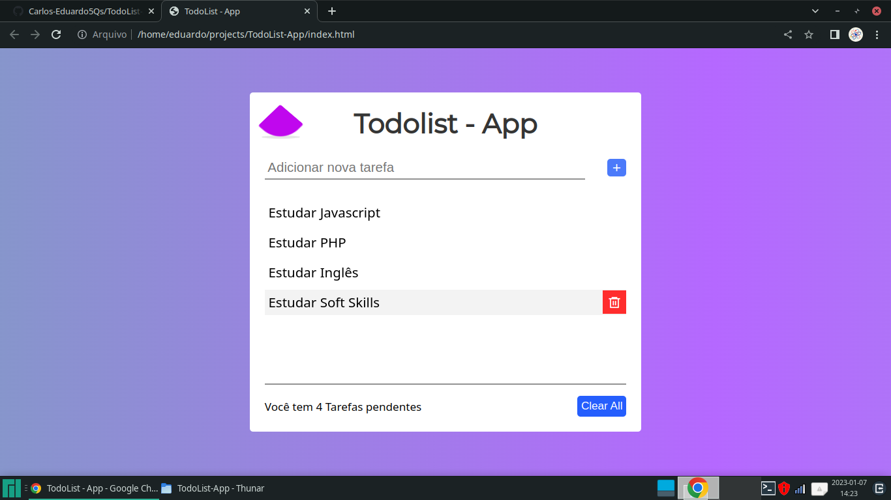

# TodoList-App
> Desenvolvido e escrito por Carlos Eduardo



Com este projeto eu tive como principal objetivo aprender a utilizar o LocalStorage para armazenar informações de usuários, eu obtive mais conhecimentos sobre como o Webpack 5 funciona e este projeto me ajudou a melhorar minha lógica de programação, afinal um bom desenvolvedor está sempre estudando lógica de programação para escolher a melhor solução para problemas do dia a dia.

## Tecnologias Ultilizadas

* Html 5
* Css 3
* Javascript
* Webpack 5

## Todas as dependências ultilizadas no projeto

* @babel-core
* @babel/preset-env
* babel-loader
* css-loader
* style-loader
* webpack
* webpack-cli

## Como rodar o projeto

Depois que você clonar este repositório, em um terminal do Linux de sua preferência rode o comando ```npm install``` para instalar todas as dependências nescessárias para o projeto, logo em seguida rode o comando ```npm run build``` para iniciar o webpack, assim o webpack ficará assistindo qualquer modificação que você fizer dentro do projeto.

## Como este projeto foi desenvolvido

Este projeto é um exercício do meu curso e durante o desenvolvimento dele eu fiz a mesma coisa só que de forma diferente e com outra lógica, eu consegui implementar novas funcionalidades como o contador de tarefas em tempo real e o botão de limpar todas as tarefas de uma só vez, eu consegui também fazer algumas animações bem trabalhadas, e para deixar bem claro, á única coisa que eu copiei foi a animação infinita com um quadrado retirada da CodePen que eu achei muito legal para o meu projeto.
